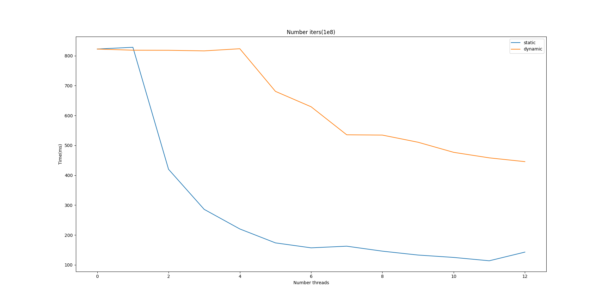
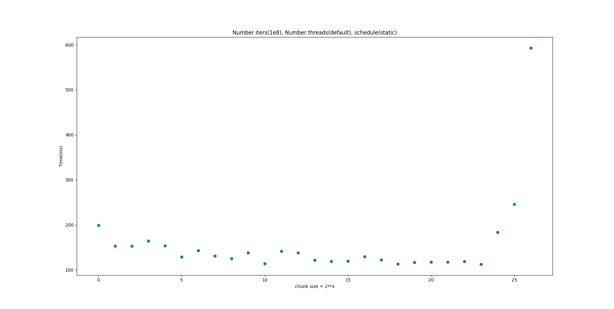
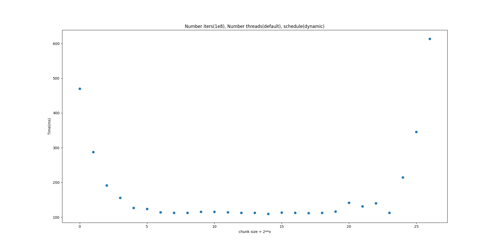

| Лабораторная работа №4 | M3101 | АОВС |
| ---------------------- | ----------- | ---- |
| OpenMP                 | Хрусталев Николай Дмитриевич | 2024 |

## Инструментарий
clang version 17.0.6 (Fedora 17.0.6-2.fc39)

Target: x86_64-redhat-linux-gnu

Thread model: posix

## Что реализовано
Работа была выполнена в полном объеме

## Результат работы на тестовых данных: [ссылка на последний успешный action с актуальными данными](https://github.com/skkv-itmo-comp-arch/se-comp-arch24-omp-Khrustalion/actions/runs/9354648037/job/25747957264)

# Описание:
Вывод в стандартный поток вывода: `Time (12 thread(s)): 2951.49 ms`

Выходной файл: `1.25658`

Процессор: `AMD RyzenTM 5 5600H`

### Описание конструкций OpenMP

Для выполнения работы были использованы директивы процессора `#pragma omp parallel`, `#pragma omp atomic` и `#pragma omp for` библиотеки `OpenMP`.

`omp_set_num_threads` - функция для установки числа потоков в параллельных регионах. Именно в параллельных регионах, так как в остальных местах программы код выполняется в однопоточном форамте.

`omp_get_thread_num` - функция для получения номера текущего потока. Это необходимо, чтобы реализовать различное поведение потоков в зависимости от их номера.

`omp_get_wtime` - функция возвращает время в секундах, прошедшее после начала работы программы.

#### `#pragma omp for`
Данная директива необходима для распределения итераций цикла `for` между потоками в параллельном регионе. То есть итерации цикла будут выполняться одновременно сразу несколькими потокамии, что может привести к уменьшению времени работы программы. Политика распределения итераций между потоками происходит путем добавления фалага `schedule`, который может принимать несколько значений типа политики - `stattic` и `dynamic`.

`static` - при такой политике итерации между потоками распределяются заранее(статически). Если не установлен `chunk_size`(число итераций в блоке, который выполняет поток), то первый поток будет выполнять с 0 итерации до `number_iters / number_threads`, 2 поток с `number_iters / number_threads` до `2 * number_iters / number_threads` и т д.

`dynamic` - при такой политике не будет заранее распределнных итераций и каждый поток по окончании выполнения блока будет брать первый свободный и выполнять этот блок. При такой политике нельзя точно сказать каким потоком будет обрабатываться определенная итерации(в отличии от `static`)

#### `#pragma omp parallel`
Данная директива создает блок кода(регион), который будет выполняться каждым потоком параллелльно. Если внутри этого блока добавить директиву `#pragma omp for`, то этот цикл будет распараллелен на все потоки и будет выполнен один раз.

### Описание работы написанного кода
Распараллеливание кода реализовано при помощи `#pragma omp parallel` и `#pragma omp for`. Внутри параллельного региона создается переменная `mt` - генератор псевдо случайных чисел. В качестве `seed` используется `get_random_device` - возвращает псевдослучайное число. Но для того, чтобы для каждого потока был установлен разный `seed` к этому число еще прибавляется номер текущего потока.

Внутри цикла с помощью `std::uniform_real_distribution` генерируются три случайных числа(для каждой из координат заранее определено свое распределение).

Так как необходимо считать количество попаданий в область, то надо завести какой-то счетчик для попаданий. Но если завести один счетчик для всех потоков, то будут случаться `race condition`(несколько потоков будут одновременно записывать числа по одному и тому же адресу и некоторые записи будут затираться). Для того, чтобы этого избежать необходимо использовать директиву `ATOMIC`, которая позволяет потокобезопасно записывать данные в левостоящую переменную в выражении.

### Тестирование

На графике изображене зависимость количества потоков от времени работы алогоритма. Легко видеть, что при любой политике `schedule` время работы алогоритма снижается. Это вполне ожидаемый результат, так как каждый поток выполняется меньшее количество итераций(или блоков. В данном случае это важно, так как все выполняемые блоки одинакового размера и ни от чего не зависят).

Также можно видеть, что при `static` алгоритм работает чуть-чуть быстрее чем при `dynamic`, почти при каждом количестве потоков. Скорее всего это просиходит из-за алгоритма: все итерации выполняются примерно одинаковое количество времени. И при заданном распределении итерации по потокам программа будет работать быстрее, так как при `dynamic` будет еще тратиться время на распределение итераций по потокам в реальном времени(то есть когда поток заканчивает блок итераций, он встанет в очередь и будет ждать следующего блока).

Еще можно заметить небольшой скачок по времени между запусками на 6 и 7 ядрах. Так как у меня 6 ядер, то при запуске на 7 потоках происходит так называемый гипертрейдинг(каждое физическоре ядро воспринимается ОС как два отдельных ядра). При некоторых рабочих нагрузках такое действие может сократить время работы(как мы можем видеть при работе на 12 ядрах).

Таким образом максимальная производительность достигается при работе на 12 потоках и `schedule(static)`.

Время работы при флагах `--no-omp` и `--omp-threads 1` практически не отличается.

На графике изображене зависимость размера блока от времени работы алогоритма при `schedule(static)`. Как видно из графика при увелечении размера блока увеличивается время рабоыт программы. Достаточно очевидно почему это происходит при `chunk_size` > `number_iters / number_threads`. Так как при таком размере последние поток будет брать на себя все меньше и меньше итераций и следовательно время работы будет выше. Исходя из этого графика можно предположить, что наилучших результатов можно добиться при `chunk_size` примерно равных `number_iters / number_threads`. В своей работе я не указывал размер блока, по умолчанию процессор делит количество итераций между потоками примерно поровну. Это позволяет разделить работу поровну между потоками и выполнять все итерации последовательно (в работе одного потока)

Аналогичный график, только с `schedule(dynamic)`. График практически не отличается от предыдущего графика. Только в области "лучшего" `chunk_size` программа работает немного медленнее.

## Изменения
Был изменен 
